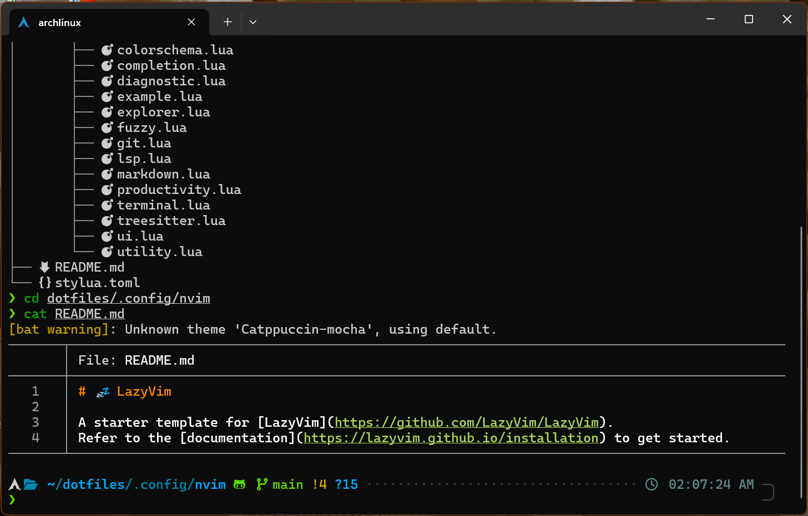

# 🛠️ Kiran's Dotfiles

My personal terminal setup for blazing-fast productivity ⚡

---

## 📸 Terminal Preview



---

## 📁 Directory Structure

```txt
dotfiles/
├── .zshrc               # Main Zsh configuration
├── .p10k.zsh            # Powerlevel10k theme config
├── zsh/
│   ├── aliases.zsh      # All command aliases
│   ├── exports.zsh      # Env variables
│   └── functions.zsh    # Custom terminal functions
├── .config/
│   └── nvim/            # Neovim config (LazyVim)
│       ├── init.lua
│       └── lua/
└── README.md
```

---

## 🚀 Setup Instructions

### 1. Clone the Repo

```bash
git clone git@github.com:kirannamawar/dotfiles.git ~/dotfiles
```

### 2. Symlink Config Files

```bash
ln -sf ~/dotfiles/.zshrc ~/.zshrc
ln -sf ~/dotfiles/.p10k.zsh ~/.p10k.zsh
ln -sf ~/dotfiles/.config/nvim ~/.config/nvim
```

### 3. Source Everything

```bash
source ~/.zshrc
```

---

## 🧠 Recommended Tools

Install all of these via `pacman`:

```bash
sudo pacman -S zsh neovim lsd bat fzf ripgrep fd lazygit zoxide git
```

Optional:

```bash
chsh -s $(which zsh)  # Set Zsh as default shell
```

---

## ✨ Aliases Highlights

| Alias    | Expands to                                |
| -------- | ----------------------------------------- |
| `v`      | `nvim`                                    |
| `..`     | `cd ..`                                   |
| `lt`     | `lsd --tree`                              |
| `gs`     | `git status`                              |
| `lg`     | `lazygit`                                 |
| `reload` | `source ~/.zshrc`                         |
| `sf`     | `fzf --preview 'bat --style=numbers ...'` |

(Defined in `zsh/aliases.zsh`)

---

## 🛠️ Functions Overview

* `mkcd foo` → Create and `cd` into `foo/`
* `extract archive.tar.gz` → Unpack archives
* `clean_node_modules` → Remove all `node_modules`
* `count_lines` → Count lines of code
* `lgit` → Open LazyGit in project root

(Defined in `zsh/functions.zsh`)

---

## 🧹 Plugins Used

* [`zsh-autosuggestions`](https://github.com/zsh-users/zsh-autosuggestions)
* [`zsh-syntax-highlighting`](https://github.com/zsh-users/zsh-syntax-highlighting)
* `fzf`, `zoxide`, `lazygit`, and more

---

## 🔐 License

MIT © Kiran

